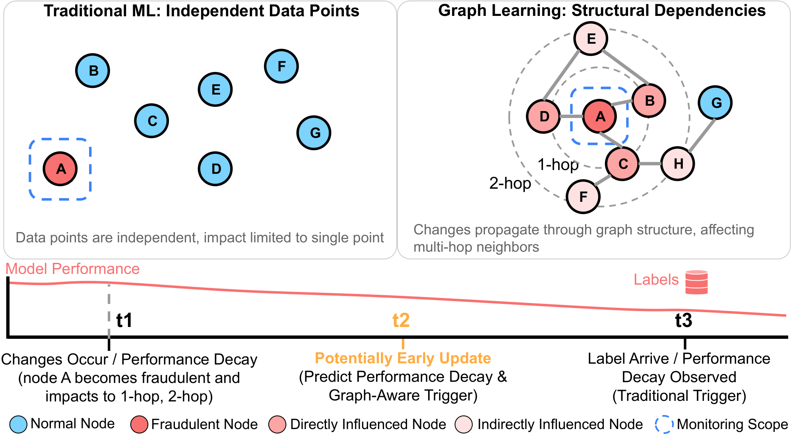
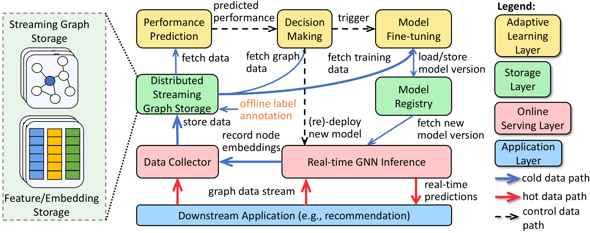

# GNNUpdater: Adaptive Self-Triggered Training Framework for Continual Graph Learning

This repository contains the code for the paper "GNNUpdater: Adaptive Self-Triggered Training Framework for Continual Graph Learning".


## Overview



GNNUpdater is the first adaptive framework for continual graph learning that determines **when to update** GNN models in streaming environments. In real-world applications like recommendation systems and fraud detection, graphs evolve constantly, causing deployed GNN models to gradually become outdated. GNNUpdater addresses the critical question of update timing by monitoring embedding shifts to predict performance degradation without requiring immediate ground truth labels, and using graph structure awareness to evaluate model health globally.



Our main contributions include:

1. **Performance Predictor**: A lightweight approach that monitors node embedding shifts to estimate model performance without requiring immediate ground truth labels. By measuring the L1 distance between current and reference embeddings of nodes and their neighbors, combined with temporal graph statistics, our predictor achieves strong correlation with actual model performance (up to -0.96).
2. **Graph-Aware Update Trigger**: A mechanism that evaluates model health across the entire graph structure rather than just focusing on recently active nodes. Using label propagation, we track how performance degradation spreads through the graph's neighborhood structure, triggering updates only when global impact reaches a significant threshold.
3. **Efficient System Implementation**: A streaming graph processing system with block-based storage, GPU-accelerated neighbor finding, and feature caching that reduces graph operation overhead by up to 92.5% compared to existing frameworks. Our implementation scales efficiently to distributed settings, maintaining over 70% scaling efficiency on 32 GPUs and handling billion-edge graphs.


GNNUpdater improves model performance by 5.3% on average (up to 34.0%) compared to existing methods with equal training costs, or reduces training costs by 2.0× on average (up to 6.0×) while maintaining comparable performance.

## Requirements

- Python 3.7+
- torch >= 1.9.0
- dgl >= 0.7
- parameterized
- pandas 
- scikit-learn
- alibi-detect
- torch_geometric
- scipy
- pyarrow
- py-tgb

We use Ubuntu 22.04 LTS with CUDA 12.4 for development and testing.

## Installation

Make sure you have `g++` and `cmake` in the PATH. You can install them using the following commands:

```bash
sudo apt-get install g++
conda install -c conda-forge cmake
```

Also, `nvcc` is required in the PATH for compiling CUDA code. You can make an alias for `nvcc` using the following command:
```bash
alias nvcc=/usr/local/cuda/bin/nvcc
```

Moreover, `cudnn` is required to compile with torch. Make sure you have `cudnn` installed in the default path `/usr/local/cuda`. 

Then, you can install the required using the following commands:

```bash
git clone https://github.com/jasperzhong/GNNUpdater.git --recursive
cd GNNUpdater
pip install -r requirements.txt
```

Finally, you can install the package using the following command:
```bash
pip install -v -e .
```

You can test the installation by running the following command:
```bash
python -c "import gnnupdater"
```

## Repo Structure

The GNNUpdater repository is organized into several key modules:

- `Dynamic Graph`: Implemented in `gnnupdater/csrc/dynamic_graph.h/cu` and exposed to Python via `gnnupdater/dynamic_graph.py`. This provides the block-based streaming graph storage structure that efficiently handles continuous graph updates.
- `Neighborhood Finder`: Implemented in `gnnupdater/csrc/temporal_sampler.h/cu` with Python bindings in `gnnupdater/temporal_sampler.py`. The CUDA kernels are implemented in `gnnupdater/csrc/sampling_kernels.cu`.
- `GPU Feature Cache`: Located in `gnnupdater/cache/` with various caching strategies (LRU, LFU, etc.) for efficiently managing node and edge features between host and device memory.
- `Distributed System`: Implemented in `gnnupdater/distributed/` with components for distributed graph partitioning, remote sampling, and RPC communication to support multi-machine training.
- `GNN Models`: Available in `gnnupdater/models/` including implementations of GraphSAGE, GAT, and Temporal GNNs with various aggregation mechanisms.
- `Performance Predictor`: Found in `gnnupdater/training/train_perf_predictor.py`, implementing the embedding drift-based performance prediction mechanism.
`Update Triggers`: Implemented in `gnnupdater/training/update_trigger.py`, containing the graph-aware update trigger mechanism with label propagation.
- `Continuous Learning`: Main integration in `gnnupdater/training/continuous_graph_learner.py` that combines all components for end-to-end adaptive continual graph learning.
- `Data Loader`: Located in `gnnupdater/data/` with various data loaders for popular graph datasets (e.g., TGB) and streaming graph generators.
- `Configuration` examples for different datasets and models can be found in the `configs/` directory, and `third-party` dependencies are included in the `third_party/` folder.


## Datasets

We use the following datasets from Temporal Graph Benchmarks (TGB) in our experiments (source links are provided given by https://github.com/shenyangHuang/TGB/blob/main/tgb/utils/info.py):
- `tgbn-genre`: https://object-arbutus.cloud.computecanada.ca/tgb/tgbn-genre.zip 
- `tgbn-reddit`: https://object-arbutus.cloud.computecanada.ca/tgb/tgbn-reddit.zip
- `tgbn-token`: https://object-arbutus.cloud.computecanada.ca/tgb/tgbn-token.zip

For these three datasets, we use `scripts/preprocess_tgbn.py` to preprocess the dataset to generate `edges.feather`, `node_features.npy`, `edge_features.npy` and `ml_{dataset}_node.pkl` (labels). 
We use `scripts/split_edges.py` to split the edges into initial data for training the base model and streaming data for continuous graph learning. It generates `split_points.npy`, which contains the indices that mark the boundaries between consecutive daily batches in the chronologically sorted edge list. Each pair of adjacent indices defines a daily batch of edges for our streaming evaluation.


The two additional datasets (GDELT and MAG) used in the paper are from TGL and please refer to https://github.com/amazon-science/tgl/blob/main/down.sh for downloading the datasets. 

## Running Experiments

Here's how to run experiments with GNNUpdater, using `tgbn_genre` dataset and TGAT model as an example:

1. Training a Base Model
First, train a base model using the first 30% of the dataset's timespan:

```bash
cd scripts
python continuous_learning.py --dataset tgbn_genre --model TGAT --phase offline 
```

This generates the base model that will be used as the starting point for continuous graph learning.

2. Training a Mini-Base Model and Collecting Training Data

To generate training data for the performance predictor:

```bash
# Train a smaller base model using only the first 10% of timespan
python continuous_learning.py --dataset tgbn_genre --model TGAT --phase offline --use_initial_offline

# Collect training pairs using the 10% - 30% portion of the data
python continuous_learning.py --dataset tgbn_genre --model TGAT --phase collect
```

This process creates training pairs that associate embedding drifts and auxiliary features with performance changes, which are used to train the performance predictor.

3. Continuous Graph Learning with Adaptive Updates

Finally, run the actual continuous graph learning process using the remaining 70% of the data:

```bash
python continuous_learning.py --dataset tgbn_genre --model TGAT --phase streaming --trigger_type label_propagation
```

You can specify different trigger types by changing the `--trigger_type` parameter:

- `interval`: Periodic updates at fixed intervals, with parameter `--interval N`  specifying the update frequency.
- `accuracy_drop` and `delayed_accuracy_drop`: Updates when performance drops below a threshold, with parameter `--accuracy_drop_threshold T` specifying the threshold. 
- `adwin` and `adwin_delayed_accuracy`: ADWIN drift detector-based updates, with parameter `--delta D` specifying the confidence value.
- `kswin` and `kswin_delayed_accuracy`: KSWIN drift detector-based updates, with parameter `--alpha A` specifying the probability for the test statistic of the Kolmogorov-Smirnov-Test.
- `label_propagation`: Our proposed graph-aware update trigger, with parameter `--problem_ratio R` specifying the ratio of nodes with performance degradation to trigger updates.


The delay in ground truth labels can be simulated by setting `--delay`, which delays the availability of ground truth labels by the specified number of days. Default is 7.

## License

This project is licensed under the MIT License - see the [LICENSE](LICENSE) file for details.